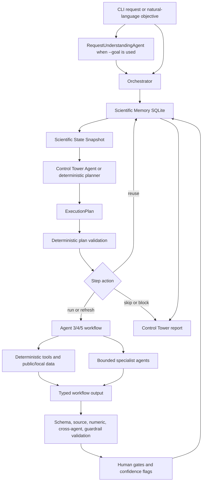

# PharmaOS

AI-native pharma operating system prototype with a memory-aware Control Tower and specialist workflow agents.

Current implementation status as of July 12, 2026: PharmaOS is a CLI-first, memory-aware clinical-development prototype. The executable workflows are Agent 3 `clinical_outcome_prediction`, Agent 4 `due_diligence`, and Agent 5 `protocol_design`. The legacy `trial_intelligence` route remains a deterministic Agent 3 landscape compatibility mode. Discovery, tox/PK-PD, enrollment feasibility, trial execution, manufacturing, launch/PV, and regulatory/quality/audit are registered skeleton capabilities, not executable systems.

## Environment

Install the repo into the virtual environment so `python -m pharma_os` and the `pharma-os` console script expose the current CLI:

```bash
./.venv/bin/python -m pip install ".[dev]"
```

Copy `.env.example` to `.env` and fill only the keys you have.

Required for live agent runs:

- `OPENAI_API_KEY`
- `PHARMA_OS_MODEL`, optional global model override. If unset, PharmaOS uses route-specific defaults.
- Route-specific model overrides:
  `PHARMA_OS_MODEL_REQUEST_UNDERSTANDING`,
  `PHARMA_OS_MODEL_CONTROL_TOWER`,
  `PHARMA_OS_MODEL_HUMAN_SUMMARY`,
  `PHARMA_OS_MODEL_AGENT3_MANAGER`,
  `PHARMA_OS_MODEL_AGENT3_SUBAGENT`,
  `PHARMA_OS_MODEL_AGENT4_MANAGER`,
  `PHARMA_OS_MODEL_AGENT4_SUBAGENT`,
  `PHARMA_OS_MODEL_AGENT5_MANAGER`,
  `PHARMA_OS_MODEL_AGENT5_SUBAGENT`.
- Default route tiers when no override is set: fast routes use `gpt-5.6-luna`, balanced routes use `gpt-5.6-terra`, and deep protocol-writing routes use `gpt-5.6-sol`.
- `PHARMA_OS_ENABLE_LIVE_AGENTS=false` forces deterministic offline fallbacks even when an API key exists.
- `PHARMA_OS_AGENTS_DISABLED=true` or `PHARMA_OS_OFFLINE=true` also forces deterministic offline fallbacks.
- `PHARMA_OS_AGENT_MAX_TURNS`, defaults to `8`
- `PHARMA_OS_LLM_MAX_RETRIES`, defaults to `4`; transient rate limits, timeouts, and server errors retry before deterministic fallback.
- `PHARMA_OS_LLM_RETRY_INITIAL_DELAY_SECONDS`, defaults to `1.0`
- `PHARMA_OS_LLM_RETRY_MAX_DELAY_SECONDS`, defaults to `30.0`
- `PHARMA_OS_LLM_MAX_INPUT_CHARS`, defaults to `60000`; maximum model-facing JSON payload size before hard compaction.
- `PHARMA_OS_LLM_MAX_STRING_CHARS`, defaults to `2500`; maximum per-string length before recursive trimming.
- `PHARMA_OS_LLM_MAX_ARRAY_ITEMS`, defaults to `30`; maximum per-array item count before recursive trimming.
- `PHARMA_OS_LLM_MAX_JSON_DEPTH`, defaults to `10`; maximum nested JSON depth before summarization.
- `PHARMA_OS_LLM_CONTEXT_COMPACTION_DISABLED=true` disables model-facing compaction for debugging only.

Optional for due diligence:

- `NCBI_API_KEY` and `NCBI_EMAIL` for more reliable PubMed market-evidence retrieval
- `CENSUS_API_KEY` for live US Census ACS population denominators used in prevalence-to-patient conversion; without it, Agent 4 uses the reviewed 2024 ACS config fallback and flags human review
- `PHARMA_OS_CENSUS_YEAR` to pin the Census ACS year instead of auto-discovery
- `PHARMA_OS_PUBMED_MAX_RETRIES`, `PHARMA_OS_PUBMED_RETRY_INITIAL_DELAY_SECONDS`, and `PHARMA_OS_PUBMED_RETRY_MAX_DELAY_SECONDS` for PubMed transient retry behavior
- `PHARMA_OS_MARKET_MAX_QUERIES` and `PHARMA_OS_MARKET_PUBMED_RESULTS_PER_QUERY` to tune Agent 4 market-evidence breadth
- `LENS_API_TOKEN` for Lens patent retrieval
- `PHARMA_OS_POS_WORKBOOK_PATH`, defaults to `data/Source_Based_PoS_Workbook.xlsx`
- `PHARMA_OS_WAC_DATA_PATH`, defaults to `data/california_wac_data.xlsx`

Config layout:

- Shared identity rules live in `src/pharma_os/data/shared/`.
- Due-diligence assumptions and source registries live in `src/pharma_os/data/due_diligence/`.
- Due diligence applies values in this order: source-backed or calculated values, user-reviewed CLI input, config fallback, then a missing-data flag plus human gate.

## Example Commands

Full Agent 3 -> Agent 4 -> Agent 5 run:

```bash
python -m pharma_os orchestrate \
--goal "Force refresh the whole suite of agents: trial prediction, commercial due diligence, and protocol design for NCT05966480"
```

This generates fresh clinical outcome prediction, clinical-stage due diligence, and protocol design artifacts, then persists sources, claims, traces, validations, gates, and reports.

## 1. Architecture Summary
PharmaOS coordinates deterministic biomedical data tools, bounded AI agents, strict Pydantic schemas, validation, human gates, and SQLite Scientific Memory. The governing loop is:

```text
Objective
-> Scientific Memory
-> Control Tower
-> Capability Registry
-> run/reuse/refresh/skip/block
-> specialist workflow
-> validation and human gates
-> memory update
-> replan when state materially changes
```

The main design principle is that Python owns workflow control, data retrieval, calculations, validation, persistence, and safety boundaries. Agents reason, synthesize, prioritize, draft, and critique inside typed contracts. Tools retrieve or calculate. Reports expose what happened, which sources were used, which validators failed, which human gates remain open, and whether AI ran live or deterministic fallback logic was used.



## 2. Repository Responsibilities

The current implementation is organized around shared control-plane modules and workflow-specific vertical slices:

| Path | Responsibility |
| --- | --- |
| `src/pharma_os/cli.py` | CLI commands for direct workflow runs, Control Tower orchestration, reports, and HTML viewers. |
| `src/pharma_os/orchestrator.py` | Direct workflow execution and bounded Control Tower orchestration loop. |
| `src/pharma_os/control_tower.py` | Control Tower agent, deterministic fallback planner, and plan validation. |
| `src/pharma_os/control_tower_state.py` | Deterministic pending-decision inference, evidence requirements, gap detection, and blocked-capability helpers. |
| `src/pharma_os/registry.py` | Capability Registry for executable workflows and non-executable skeleton modules. |
| `src/pharma_os/schemas.py` | Strict Pydantic contracts for workflow inputs, outputs, evidence, memory, agents, plans, gates, and reports. |
| `src/pharma_os/memory.py` | SQLite Scientific Memory and artifact reuse/freshness/compatibility assessment. |
| `src/pharma_os/agent_runtime.py` | Shared OpenAI Agents SDK and direct structured LLM runtime, retries, context compaction, and fallback tracing. |
| `src/pharma_os/validators.py` | Schema, source, numeric, cross-agent, workflow-boundary, and semantic validation. |
| `src/pharma_os/workflows/` | Executable Agent 3, Agent 4, Agent 5, and compatibility trial-landscape workflow functions. |
| `src/pharma_os/agents/` | Bounded manager/subagent reasoning wrappers with deterministic fallbacks. |
| `src/pharma_os/tools/` | Deterministic API clients, calculators, source adapters, and config loaders. |
| `src/pharma_os/components/` | Reusable deterministic workflow components, including trial landscape and due-diligence section builders. |
| `src/pharma_os/report.py` and `src/pharma_os/html_report.py` | Final report payloads, run HTML viewers, and cumulative NCT development reports. |
| `src/pharma_os/data/` and `data/` | Packaged and repo-local YAML config plus local PoS/WAC workbooks. |

## 3. Interface Layer

The primary interface is the CLI. Direct workflow runs use structured workflow inputs built from flags or `--input-json`.

Control Tower orchestration uses a natural-language objective. Goals are intentionally AI-first: `RequestUnderstandingAgent` extracts target capability, NCT ID, decision type, assumptions, refresh hints, skip hints, requested outputs, and execution scope. Explicit CLI fields override or validate the AI parse. `--input-json` is the structured non-AI bypass for a complete `OrchestrationRequest`.

Reports are generated from Scientific Memory.

If output paths are omitted, JSON and HTML outputs are written under `outputs/`, and persistent NCT runs also update a cumulative HTML report under `reports/`.

## 4. Control Tower Orchestration

The `Orchestrator` supports direct `run()`, planning-only `plan()`, and full `orchestrate()` flows.

For orchestration, it first builds a `ScientificStateSnapshot` from Scientific Memory and the Capability Registry. The snapshot includes:

- compatible, stale, incompatible, and unknown artifacts
- pending downstream decision
- evidence requirements for that decision
- requirement satisfaction and critical gaps
- unresolved or contradictory claims
- open human gates
- blocked skeleton capabilities and missing connectors

The Control Tower returns an `ExecutionPlan` whose steps are one of `run`, `reuse`, `refresh`, `skip`, or `block`. Live planning uses the OpenAI Agents SDK when enabled. The deterministic fallback planner stays minimal and registry-driven so offline runs and tests remain stable.

Every plan is deterministically validated before execution. The validator checks dependency order, missing dependencies, attempts to execute skeleton modules, reuse of missing or incompatible artifacts, unjustified refreshes, unnecessary reruns, force-refresh handling, target-only scope, blocking human gates, and whether each run or refresh step addresses pending decision evidence requirements.

During execution:

1. `reuse` records a reused artifact step and carries forward any open gates.
2. `run` or `refresh` maps the plan step to the correct workflow input schema.
3. The workflow runs and persists its own output, sources, claims, traces, validations, flags, gates, and report.
4. The workflow output is marked current for the NCT ID when successful, superseding older matching outputs.
5. Scientific Memory builds a new snapshot.
6. The Control Tower replans when artifact state materially changes, bounded by `max_steps` and `max_replans`.

## 5. Capability Registry

The Capability Registry is the Control Tower's map of what can run and what must block.

| Capability | Status | Role | Dependencies | Produced artifacts |
| --- | --- | --- | --- | --- |
| `clinical_outcome_prediction` | implemented | Agent 3 clinical outcome/risk context for one NCT ID. | none | `clinical_outcome_prediction_output`, `clinical_risk_context` |
| `due_diligence` | implemented | Agent 4 clinical-stage diligence with safety, IP, pricing, commercial, and rNPV context. | `clinical_outcome_prediction` | `due_diligence_output`, `asset_memo`, `commercial_model`, `rnpv` |
| `protocol_design` | implemented | Agent 5 next-study draft protocol design brief using Agent 3/4 handoffs and analog benchmarking. | `clinical_outcome_prediction`, `due_diligence` | `protocol_design_output`, `protocol_design_brief`, `next_study_intent` |
| `discovery` | skeleton | Target and discovery prioritization. | none | blocked until target/omics/assay connectors exist |
| `tox_pkpd_safety` | skeleton | Nonclinical safety and PK/PD planning. | `discovery` | blocked until nonclinical and PK/PD systems exist |
| `enrollment_feasibility` | skeleton | Enrollment feasibility and operations planning. | `protocol_design` | blocked until site, patient population, and startup systems exist |
| `trial_execution` | skeleton | Live trial operations control. | `enrollment_feasibility` | blocked until CTMS, EDC, site activation, and RBQM systems exist |
| `manufacturing_biofactory` | skeleton | Manufacturing and biofactory orchestration. | `due_diligence` | blocked until MES/LIMS/batch/supply-chain systems exist |
| `launch_pv` | skeleton | Launch readiness and PV control. | `regulatory_quality_audit` | blocked until PV, medical information, and launch systems exist |
| `regulatory_quality_audit` | skeleton | Regulatory and quality audit planning. | `protocol_design` | blocked until regulatory document, QMS, and submission systems exist |

The compatibility `trial_intelligence` route is runnable from the CLI but is not a separate top-level registry agent. It wraps the deterministic Agent 3 trial-landscape component.

## 6. Scientific Memory

Scientific Memory is SQLite-first and is implemented by `MemoryStore`. The default path is `.pharma_os/scientific_memory.sqlite`.

The schema stores:

| Table | Stored data |
| --- | --- |
| `runs` | Workflow run envelopes, input JSON, output JSON, bounded trace metadata, status, validation status, and NCT metadata. |
| `sources` | `SourceMetadata` with title, URL, authors, retrieved date, provenance, source type, version, and payload JSON. |
| `claims` | Source-backed `EvidenceClaim` rows with confidence and qualifiers. |
| `agent_outputs` | Typed agent output envelopes, execution mode, validation status, and payload JSON. |
| `agent_traces` | Safe, user-readable traces without hidden reasoning. |
| `validation_results` | Validator results and gate reasons. |
| `confidence_flags` | Canonical review/confidence flags. |
| `human_gates` | Human review gates and required roles. |
| `reports` | Final report payloads. |

Artifact reuse is memory-derived. For a request and workflow capability, the store finds matching completed outputs, filters by NCT ID when present, ignores superseded lineage unless needed for status, extracts output IDs and confidence, evaluates freshness, and determines compatibility. Freshness becomes `stale` when source or run age exceeds 180 days. Older successful outputs for the same workflow/NCT are marked superseded when a newer output is marked current.

Compatibility considers workflow, request identifiers, input assumptions, validation status, freshness, and open gates. Reused artifacts are recorded explicitly through `Agent3HandoffReference`, `Agent4HandoffReference`, Control Tower step results, and execution mode summaries.

## 7. Agent Runtime

All live reasoning routes share `agent_runtime.py`. It supports:

- OpenAI Agents SDK structured calls for manager-style coordination.
- Direct structured LLM calls for narrow one-shot reasoning.
- deterministic fallback outputs for offline, disabled, or failed live calls.
- retry handling for transient API errors.
- model route selection.
- model-facing context compaction.
- visible `ExecutionModeSummary` counts.

The allowed execution modes are `live_agent`, `direct_llm`, `deterministic_fallback`, and `reused_artifact`. These modes are not hidden metadata. They are surfaced in workflow outputs, agent traces, agent-output envelopes, Control Tower records, HTML views, and reports.

Route defaults are:

| Tier | Default model |
| --- | --- |
| fast | `gpt-5.6-luna` |
| balanced | `gpt-5.6-terra` |
| deep | `gpt-5.6-sol` |

Route-specific environment variables can override these defaults, including `PHARMA_OS_MODEL_REQUEST_UNDERSTANDING`, `PHARMA_OS_MODEL_CONTROL_TOWER`, `PHARMA_OS_MODEL_AGENT3_MANAGER`, `PHARMA_OS_MODEL_AGENT4_SUBAGENT`, and `PHARMA_OS_MODEL_AGENT5_MANAGER`. `PHARMA_OS_ENABLE_LIVE_AGENTS=false`, `PHARMA_OS_AGENTS_DISABLED=true`, or `PHARMA_OS_OFFLINE=true` forces deterministic fallback behavior.

Context compaction trims only model-facing JSON. Full typed state remains persisted in Scientific Memory and output artifacts. Traces record whether compaction was applied, original and compacted character counts, and truncated paths.

## 8. Agent 3: Clinical Outcome Prediction

`clinical_outcome_prediction` is the canonical Agent 3 workflow for one NCT ID. It produces a `ClinicalOutcomePredictionOutput`.

Process:

1. Fetch the target trial from ClinicalTrials.gov API v2.
2. Resolve asset identity from CT.gov interventions, active intervention semantics, RxNorm normalization, shared YAML rules, sponsor aliases, and human overrides.
3. Lookup historical PoS from `Source_Based_PoS_Workbook.xlsx`; numeric PoS is never AI-generated.
4. Search CT.gov comparator landscape using the internal trial-landscape component.
5. Attempt openFDA label lookup for safety context.
6. Build deterministic trial identity, design features, endpoint risk, enrollment/duration risk, approval likelihood proxy, failure modes, source availability, assumptions, missing-data flags, and evidence claims.
7. Run bounded manager/subagents when live agents are enabled, with deterministic fallbacks for the same typed outputs.
8. Validate schema, source coverage, numeric provenance, and clinical-outcome guardrails.
9. Assign human gates when validation fails or high-risk/missing evidence warrants review.
10. Persist sources, claims, subagent outputs, traces, validations, confidence flags, gate, final report, and cumulative NCT report.

Agent 3 is not an outcome oracle and must not issue go/no-go, approval, licensing, investment, invented efficacy, invented safety-rate, or unsupported probability conclusions.

## 9. Agent 4: Due Diligence

`due_diligence` is the canonical Agent 4 clinical-stage diligence workflow. It produces a `DueDiligenceOutput`.

Process:

1. Reuse the latest compatible Agent 3 output for the same NCT ID unless `refresh_agent3` is set; otherwise run Agent 3.
2. Convert Agent 3 into a typed `ClinicalRiskSummary`.
3. Fetch and canonicalize the target CT.gov trial.
4. Resolve asset identity again against the current target trial.
5. Build clinical evidence from CT.gov and PubMed E-utilities.
6. Build competitive landscape from the Agent 3 comparator bundle.
7. Summarize openFDA label safety when a label match exists.
8. Search Lens patent data when `LENS_API_TOKEN` is configured; otherwise flag LOE as missing. A reviewed `loe_year` override is allowed and explicitly sourced as human input.
9. Lookup PoS from the source workbook.
10. Lookup pricing from local California WAC data and openFDA label/dosing evidence. Pricing analogs may be proposed by a structured subagent, but final WAC matching and annualization are deterministic and source-constrained.
11. Build commercial model inputs from reviewed CLI assumptions, PubMed market evidence, Census population denominator when available, YAML defaults, and pricing. Deterministic code calculates patient funnel, net price, penetration, launch ramp, and revenue cases.
12. Calculate rNPV deterministically from commercial forecast, workbook PoS, LOE, launch year, discount rate, tax rate, operating margin, development cost, and post-LOE logic.
13. Build rule-based red flags and a draft asset memo.
14. Run Agent 4 manager/subagents for bounded synthesis and critique, preserving deterministic fallback output.
15. Validate schema, source coverage, numeric provenance, cross-agent consistency, and due-diligence guardrails.
16. Persist all artifacts and mark the output current when successful.

Agent 4 may draft a diligence memo but must not make final investment, acquisition, licensing, approval, legal, freedom-to-operate, or go/no-go decisions. Missing values become flags and gates.

## 10. Agent 5: Protocol Design Brief

`protocol_design` is the canonical Agent 5 workflow. It produces a `ProtocolDesignOutput` containing a first-class `AnalogBenchmarkBundle` and a draft `ProtocolDesignBrief`.

Process:

1. Reuse or generate Agent 3 and Agent 4 handoffs unless `refresh_agent3` or `refresh_agent4` is set.
2. Use the Agent 4 target trial as the canonical protocol-design target.
3. Create agent-output source references for the consumed Agent 3 and Agent 4 handoffs.
4. Build a manager plan and CT.gov analog search plan.
5. Execute CT.gov analog searches deterministically, deduplicate by NCT ID, and preserve query source IDs.
6. Annotate candidates with deterministic semantic features for indication, modality, endpoint family, comparator structure, route, phase, population, and design.
7. Select and normalize analog trials. Deterministic repair ensures every retrieved candidate is selected, excluded, or unevaluable.
8. Hydrate selected analogs with full CT.gov records when needed.
9. Search for follow-on lineage candidates constrained by same asset, same indication, and same sponsor.
10. Adjudicate follow-on trials without forcing a successor when lineage evidence is weak.
11. Calculate direct analog benchmarks and, when available, follow-on benchmarks. Metrics include enrollment, study duration, treatment duration, endpoint timing, arms, randomization, blinding, endpoint families, comparator categories, countries, sites, statuses, and results availability.
12. Build qualitative synthesis and analog-derived design decisions with explicit support-source labels.
13. Draft protocol strategy sections, eligibility framework, schedule framework, safety monitoring outline, statistical skeleton, operational risks, regulatory considerations, and reviewer critique.
14. Attach a mandatory human gate for clinical, statistical, and regulatory review.
15. Validate schema, source coverage, numeric provenance, source boundaries, draft status, analog benchmark presence, semantic consistency, zero-follow-on semantics, missing-data contradictions, fractional enrollment, duration labels, and support-source consistency.

Agent 5 is not a full protocol authoring system. It must not produce an IRB-ready, submission-ready, enrollment-ready, approved, or final protocol.

## 11. Deterministic Tool Layer

The tool layer is where external retrieval and calculations live.

| Tool/module | Sources or inputs | Outputs |
| --- | --- | --- |
| `tools/clinicaltrials.py` | ClinicalTrials.gov API v2 | Normalized `ClinicalTrialRecord`, search results, source metadata. |
| `tools/rxnorm.py` | RxNorm REST API | Best-effort drug normalization and aliases. |
| `tools/asset_identity.py` | CT.gov, RxNorm, YAML rules, human overrides | `AssetIdentityOutput`. |
| `components/trial_landscape.py` | CT.gov search | Deterministic trial landscape output and risk flags. |
| `tools/pubmed.py` | PubMed E-utilities | Article metadata and literature source IDs. |
| `components/due_diligence_sections.py` | Agent 3, CT.gov, PubMed, openFDA, diligence outputs | Clinical evidence, landscape, safety, patent review, red flags, asset memo. |
| `tools/patents_lens.py` | Lens Patent Search API, optional human LOE override | Patent candidates, relevance review, estimated LOE when supported. |
| `tools/pos.py` | Local source-based PoS workbook | Source-derived PoS lookup. |
| `tools/pricing.py` | Local WAC workbook, openFDA labels/dosing, optional structured analog selection | Annual WAC, dosing support, pricing flags. |
| `tools/census.py` | US Census ACS API when configured | US population denominator for commercial sizing. |
| `tools/commercial_model.py` | Pricing, CT.gov, PubMed market evidence, Census, YAML defaults, user assumptions | Patient funnel, commercial cases, revenue forecast, assumption ledger. |
| `tools/rnpv.py` | Commercial model, PoS, LOE, YAML assumptions, user assumptions | Deterministic rNPV. |
| `tools/protocol_design.py` | CT.gov, Agent 3/4 handoffs | Analog search execution, similarity scoring, follow-on lineage, benchmarks, protocol claims/brief assembly. |
| `tools/rules.py` | Packaged/repo YAML config | Shared configuration and source metadata. |

Tools must preserve source metadata, return typed objects, distinguish missing data from failed calls, avoid silent fallback data, and avoid LLM calls inside low-level API clients.

## 12. Data Sources And Configuration

Current implemented sources:

- ClinicalTrials.gov API v2 for trial identity, design, arms, interventions, eligibility, locations, endpoints, status, dates, and analog benchmarking.
- RxNorm REST API for best-effort drug normalization.
- PubMed E-utilities for article metadata and market/evidence search.
- openFDA drug label API for safety label and dosing context.
- Lens Patent Search API for patent candidates when `LENS_API_TOKEN` is set.
- US Census ACS API for population denominators when `CENSUS_API_KEY` is set.
- Local `Source_Based_PoS_Workbook.xlsx` for numeric PoS.
- Local `california_wac_data.xlsx` for WAC evidence.
- YAML configs for identity rules, market assumptions, market queries, WAC source policy, and rNPV assumptions.

Due diligence selects values in this order where applicable: source-backed or calculated values, user-reviewed CLI input, config fallback, then missing-data flag plus human gate.

The package first reads config from `src/pharma_os/data/`, then repo-local `data/`. This supports packaged installs while retaining local workbook/config overrides.

## 13. Validation And Human Gates

Validation is deterministic and visible. Shared validators include:

- schema validation against strict Pydantic models
- source coverage for evidence claims
- numeric provenance checks
- Agent 3 to Agent 4 cross-agent consistency
- Agent 3 clinical outcome guardrails
- Agent 4 diligence guardrails
- Agent 5 source-boundary, draft-gate, analog-benchmark, and semantic consistency checks
- Control Tower execution-plan validation

Human gates are created when validation fails, high-risk language appears, required evidence is missing or low confidence, or a workflow is intrinsically draft-only. Agent 5 always carries a human clinical/statistical/regulatory review gate. Gates are stored in Scientific Memory and surfaced in reports and reuse decisions.

## 14. Reporting And Audit Outputs

Every workflow persists a run-level `FinalReport`. The CLI can also render:

- JSON workflow outputs.
- per-run HTML viewers with metadata, source-backed claims, raw input/output JSON, agent outputs, sources, validations, confidence flags, gates, and traces.
- cumulative NCT HTML development reports that combine the latest current Agent 3, Agent 4, and Agent 5 outputs for an NCT ID.

Reports intentionally surface deterministic fallbacks, live AI calls, reused artifacts, validation failures, confidence flags, and human gates.

## 15. Extension Pattern

New executable capabilities should follow the existing architecture:

1. Add or extend strict schemas in `schemas.py`.
2. Implement deterministic retrieval/calculation in `tools/` or reusable components in `components/`.
3. Add bounded agents in `agents/` only for reasoning, synthesis, critique, or drafting.
4. Add a workflow in `workflows/` that owns sequencing and persistence.
5. Register the capability in `registry.py` with accepted inputs, dependencies, produced artifacts, evidence requirements, human-gate policy, and implementation path.
6. Add validators for source coverage, numeric provenance, cross-agent consistency, and workflow-specific safety boundaries.
7. Persist sources, claims, agent outputs, traces, validation results, confidence flags, gates, and reports.
8. Add focused pytest coverage with network-independent fixtures.
9. Update `README.md` and `AGENTS.md` in the same change.

Skeleton modules should remain non-executable until real public data/tools or real system connectors exist. PharmaOS should block unavailable modules with typed reasons rather than fake regulated, patient, site, manufacturing, or commercial execution data.
